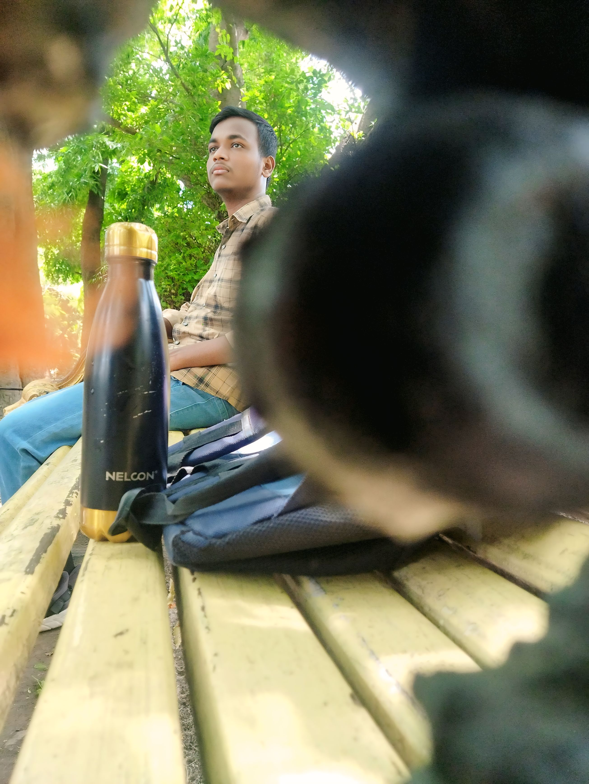

<p align="center">
  
</p>

<h1 align="center">🚀 Soumyadip Maity — Portfolio</h1>

<p align="center">
  A modern, animated developer portfolio built with <strong>Next.js 14</strong>, <strong>TypeScript</strong>, and pure CSS magic.
</p>

<p align="center">
  <a href="https://github.com/Maitysoumya12345"></a>
  <a href="https://linkedin.com/in/soumyadip-maity-996686353"></a>
  <a href="https://leetcode.com/u/_soumya__dip_/"></a>
</p>

---

## ✨ Features

| Feature | Description |
|---------|-------------|
| 🎨 **Animated Particles** | Interactive particle background across all pages |
| ⌨️ **Typewriter Effect** | Dynamic text animation on the hero section |
| 📜 **Scroll Reveal** | Elements animate into view as you scroll |
| ⬆️ **Scroll to Top** | Smooth scroll-to-top button |
| ⏳ **Loading Screen** | Sleek loading animation on initial visit |
| 📱 **Fully Responsive** | Looks great on every screen size |
| ⚡ **Fast & SEO-friendly** | Powered by Next.js App Router with metadata API |

---

## 🗂️ Pages

- **Home** — Hero section with greeting, typewriter, social links & CTA buttons
- **About** — Introduction, profile image, and interest tags
- **Skills** — Skill cards with proficiency levels (HTML, CSS, JS, C, Java, Python)
- **Projects** — Showcase of live projects with images, tags & links
- **Contact** — Get in touch form / info

---

## 🛠️ Tech Stack

<p>
  
  
  
  
  
</p>

---

## 📁 Project Structure

```
src/
├── app/
│   ├── layout.tsx        # Root layout (Navbar, Footer, Particles, Loader)
│   ├── page.tsx           # Home / Hero page
│   ├── globals.css        # All styles
│   ├── about/page.tsx     # About page
│   ├── skills/page.tsx    # Skills page
│   ├── projects/page.tsx  # Projects page
│   └── contact/page.tsx   # Contact page
├── components/
│   ├── Footer.tsx         # Site footer
│   ├── Loader.tsx         # Loading screen
│   ├── Navbar.tsx         # Navigation bar
│   ├── Particles.tsx      # Particle background
│   ├── RevealOnScroll.tsx # Scroll reveal animation
│   ├── ScrollToTop.tsx    # Scroll-to-top button
│   └── Typewriter.tsx     # Typewriter text effect
└── public/
    └── images/            # Static assets
```

---

## 🚀 Getting Started

### Prerequisites

- **Node.js** ≥ 18
- **npm** or **yarn**

### Installation

```bash
# Clone the repository
git clone https://github.com/Maitysoumya12345/newPortfolio-nextjs.git
cd newPortfolio-nextjs

# Install dependencies
npm install

# Start the development server
npm run dev
```

Open [http://localhost:3000](http://localhost:3000) in your browser to see the result.

### Build for Production

```bash
npm run build
npm start
```

---

## 📸 Preview

| Home | Projects |
|------|----------|
| Hero with typewriter & particles | Card grid with live links |

---

## 📬 Contact

Feel free to reach out!

- **Email:** [maitysoumya108@gmail.com](mailto:maitysoumya108@gmail.com)
- **LinkedIn:** [Soumyadip Maity](https://linkedin.com/in/soumyadip-maity-996686353)
- **GitHub:** [@Maitysoumya12345](https://github.com/Maitysoumya12345)

---

<p align="center">
  Made with ❤️ by <strong>Soumyadip Maity</strong>
</p>
