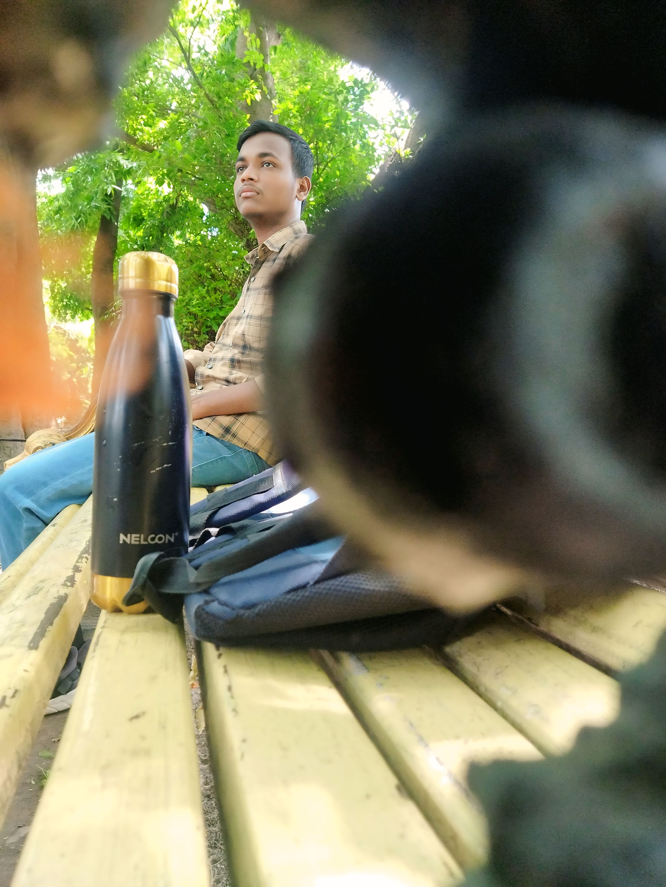

<p align="center">
  
</p>

<h1 align="center">🚀 Soumyadip Maity — Portfolio</h1>

<p align="center">
  A cinematic, ultra-premium developer portfolio built with <strong>Next.js 15</strong>, <strong>TypeScript</strong>, <strong>Tailwind CSS</strong>, and <strong>Framer Motion</strong>.
  <br />
  Designed with the <strong>"Nebula Glass"</strong> design system — featuring glassmorphism, animated gradients, and micro-interactions.
</p>

<p align="center">
  <a href="https://github.com/Soumya9679"></a>
  <a href="https://linkedin.com/in/soumyadip-maity-996686353"></a>
  <a href="https://leetcode.com/u/_soumya__dip_/"></a>
</p>

---

## ✨ Features

| Feature | Description |
|---------|-------------|
| 🎨 **Nebula Glass Design** | Premium dark theme with Electric Violet → Vivid Cyan gradient system |
| 🪟 **Glassmorphism** | Frosted-glass cards with gradient ghost-borders and backdrop blur |
| ✨ **Animated Gradients** | Floating nebula orbs, shimmer effects, and pulse-glow animations |
| ⌨️ **Typewriter Effect** | Terminal-style dynamic text animation with gradient cursor |
| 📜 **Scroll Reveal** | Blur-to-focus entrance animations powered by Framer Motion |
| 📄 **CV Download** | One-click resume download from the hero section |
| 📱 **Fully Responsive** | Mobile-first design with an immersive full-screen menu |
| ⚡ **Fast & SEO-friendly** | Next.js App Router with static generation and metadata API |
| ♿ **Accessible** | Focus-visible styles, reduced-motion support, semantic HTML, ARIA labels |

---

## 🎨 Design System — "Nebula Glass"

The portfolio uses a curated design system inspired by cinematic dark UI:

| Token | Value | Purpose |
|-------|-------|---------|
| Base Background | `#06080F` | Deep obsidian foundation |
| Surface | `#11131b` | Card & container layer |
| Primary | `#A855F7` → `#ddb7ff` | Electric Violet accents |
| Secondary | `#22D3EE` → `#5de6ff` | Vivid Cyan highlights |
| Tertiary | `#ca801e` → `#ffb869` | Warm Amber accents |
| Display Font | Manrope | Headlines & hero text |
| Body Font | Inter | Body text & UI labels |
| Code Font | JetBrains Mono | Badges & monospace elements |

---

## 🗂️ Sections

- **Hero** — Animated gradient name, typewriter roles, "Available for work" badge, CTA buttons (View Work, Download CV, Get In Touch), social links
- **About** — Profile image with refractive glow, bio text, highlight tags (Web Dev, Creative Coding, etc.)
- **Skills** — Glass cards with animated gradient progress bars, shimmer effects, and glowing end dots
- **Projects** — 3-column grid of project cards with image hover effects, tech-chip tags, and action links
- **Contact** — Social links with unique gradient icons + contact form with validation
- **Footer** — Gradient logo, social icons, and tagline

---

## 🛠️ Tech Stack

<p>
  
  
  
  
  
  
</p>

---

## 📁 Project Structure

```
src/
├── app/
│   ├── layout.tsx          # Root layout (fonts, navbar, footer, background)
│   ├── page.tsx            # Home — all sections rendered here
│   ├── globals.css         # Nebula Glass design tokens & component styles
│   └── not-found.tsx       # Custom 404 page
├── components/
│   ├── effects/
│   │   ├── AnimatedBackground.tsx  # Nebula orbs, dot grid, vignette
│   │   ├── MotionWrapper.tsx       # Reusable scroll-reveal wrapper
│   │   └── Typewriter.tsx          # Terminal-style typewriter effect
│   ├── layout/
│   │   ├── Navbar.tsx       # Frosted-glass refractive header
│   │   ├── Footer.tsx       # Gradient divider + glass footer
│   │   └── ScrollToTop.tsx  # Glass scroll-to-top button
│   ├── sections/
│   │   ├── Hero.tsx         # Cinematic hero with gradient text
│   │   ├── About.tsx        # Profile with refractive glow
│   │   ├── Skills.tsx       # Animated progress bars
│   │   ├── Projects.tsx     # Project card grid
│   │   └── Contact.tsx      # Form + social links
│   └── ui/
│       └── SectionHeading.tsx  # Badge + heading + gradient divider
├── lib/
│   └── utils.ts            # Utility functions (cn)
└── public/
    ├── images/             # Project screenshots & profile photo
    └── Soumyadip_Maity_CV.pdf  # Downloadable resume
```

---

## 🚀 Getting Started

### Prerequisites

- **Node.js** ≥ 18
- **npm** or **yarn**

### Installation

```bash
# Clone the repository
git clone https://github.com/Soumya9679/portfolio_website.git
cd portfolio_website

# Install dependencies
npm install

# Start the development server
npm run dev
```

Open [http://localhost:3000](http://localhost:3000) in your browser to see the result.

### Build for Production

```bash
npm run build
npm start
```

---

## 📬 Contact

Feel free to reach out!

- **Email:** [maitysoumya108@gmail.com](mailto:maitysoumya108@gmail.com)
- **LinkedIn:** [Soumyadip Maity](https://linkedin.com/in/soumyadip-maity-996686353)
- **GitHub:** [@Soumya9679](https://github.com/Soumya9679)
- **LeetCode:** [@_soumya__dip_](https://leetcode.com/u/_soumya__dip_/)

---

<p align="center">
  Made with ❤️ & modern magic by <strong>Soumyadip Maity</strong>
</p>
